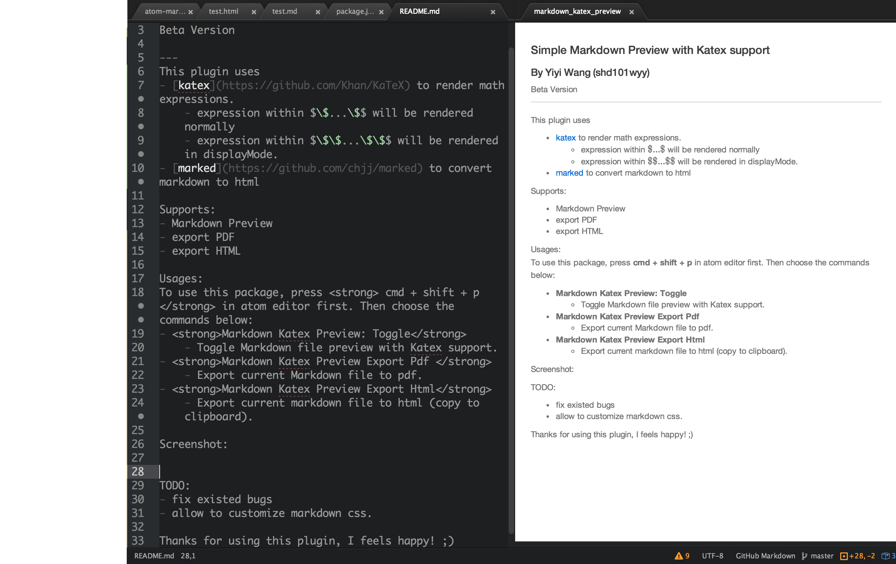
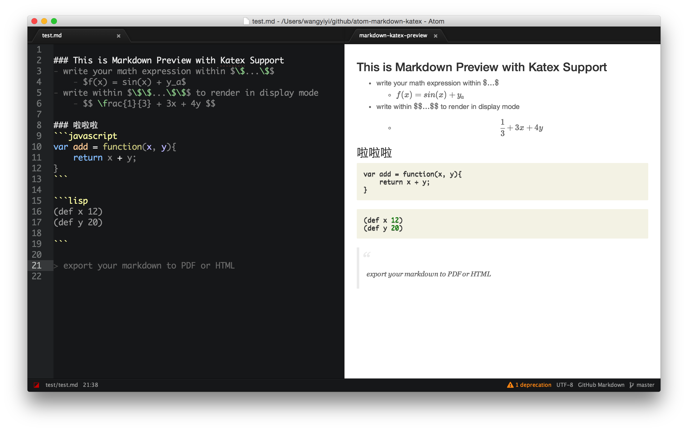
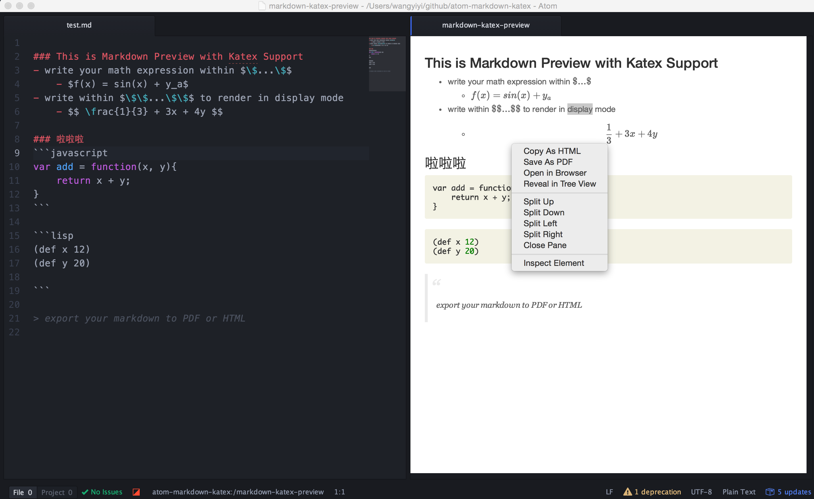
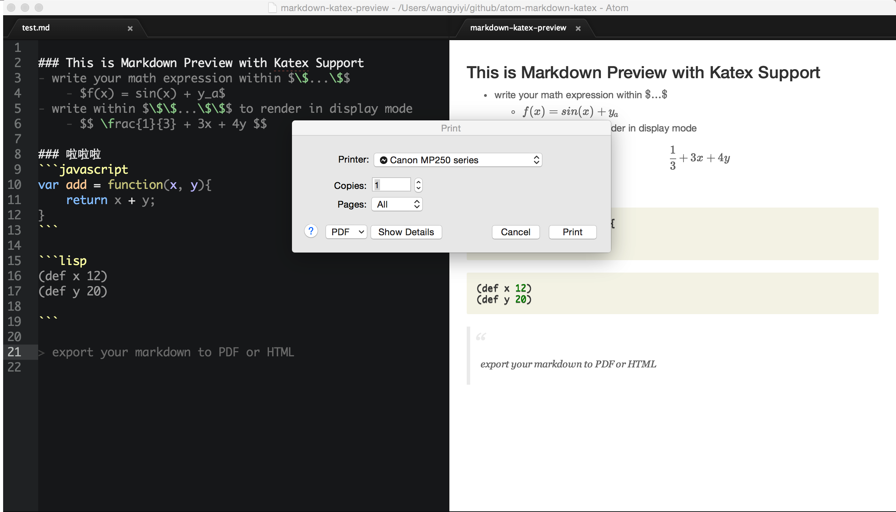
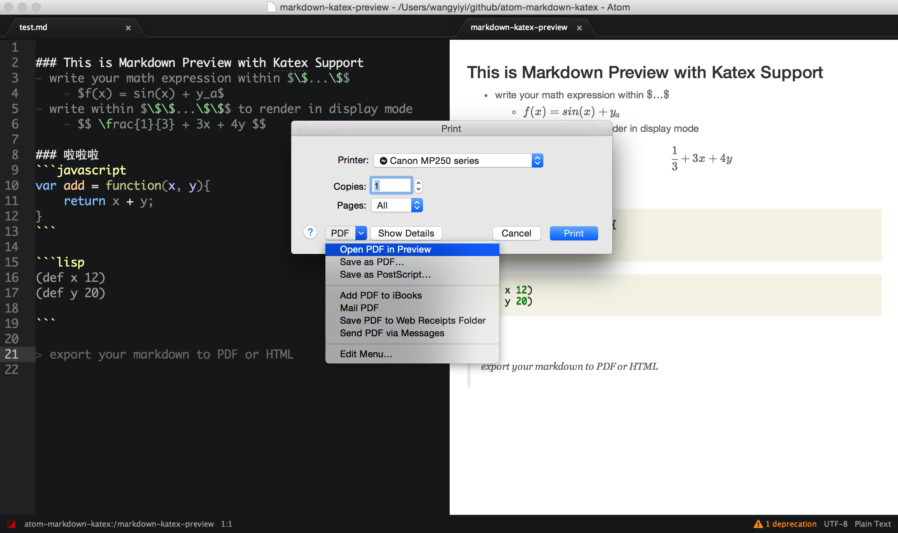
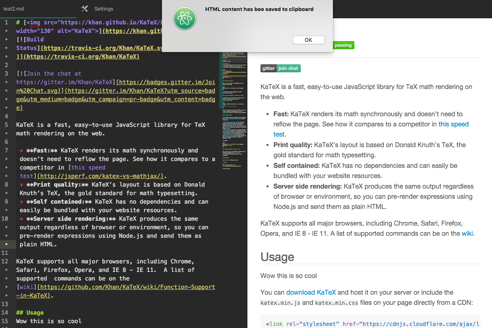
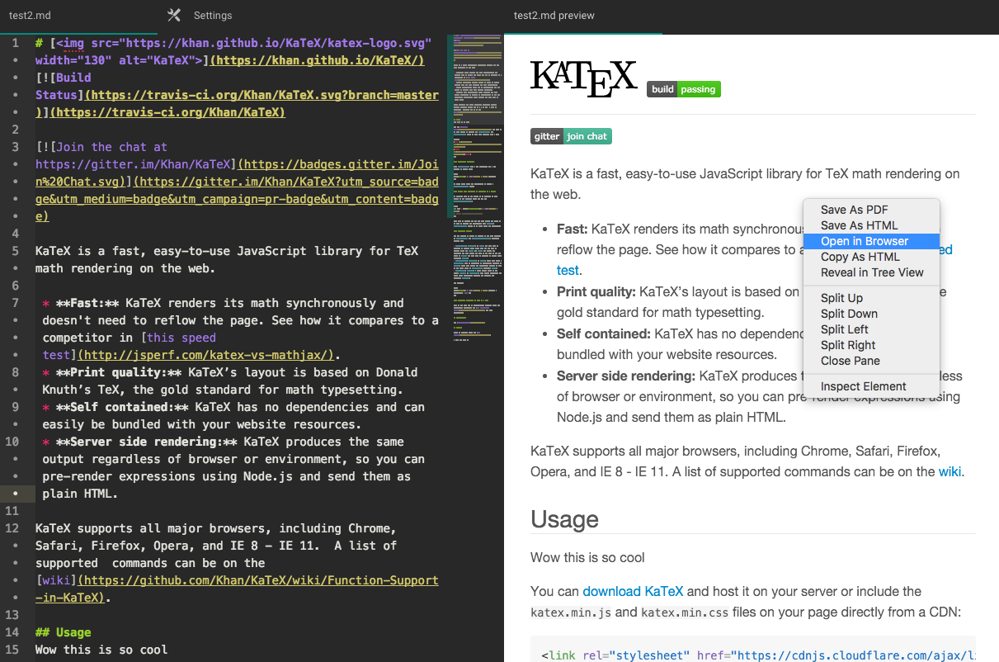
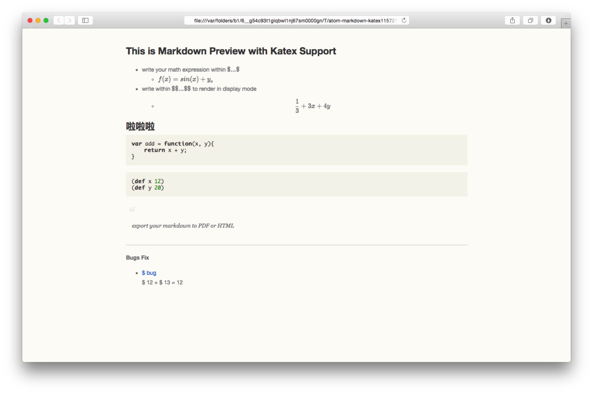

### Simple Markdown Preview with KaTex support
#### By Yiyi Wang (shd101wyy)
Beta Version

---
<strong>This plugin uses</strong>
- [KaTex](https://github.com/Khan/KaTeX) to render math expressions.
    - expression within $\$...\$$ will be rendered normally
    - expression within $\$\$...\$\$$ will be rendered in displayMode.
- [marked](https://github.com/chjj/marked) to convert markdown to html

<strong>Online Demo:  </strong>
- [simple demo](https://rawgit.com/shd101wyy/atom-markdown-katex/master/index_katex.html)

<strong>Supports:</strong>
- Markdown Preview
- export PDF
- export HTML
- customize Markdown Preview css

<strong>Usages:</strong>  
To use this package, press <strong> cmd + shift + p </strong> in atom editor first to toggle <strong> Command Palette </strong>. Then choose the commands below:
- <strong>Markdown KaTex Preview: Toggle</strong>
    - Toggle Markdown file preview with KaTex support.
- <strong>Markdown KaTex Preview: Customize CSS</strong>
    - Customize preview page css.  
    
---
- Toggle preview.  
  

---
- Real time preview with katex support.  
    

---
- Save As PDF - right click at preview.  
  
  
  
    

---
- Copy As HTML - right click at preview.  
   

---
- Customize Preview CSS.  
    

---
TODO:
- fix existed bugs.
- modify css to make preview look nice.
- better pdf print.

Thanks for using this plugin, I feel happy! ;)

> MIT License
