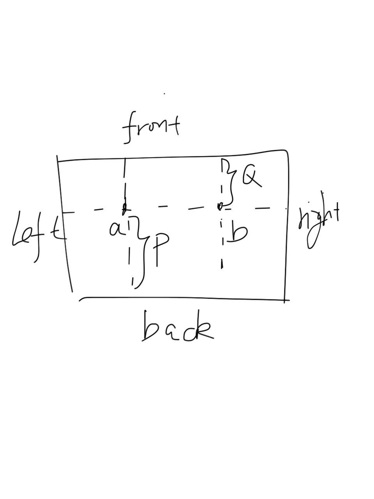

### This is Markdown Preview with KaTeX Support
- write your math expression within $\$...\$$
    - $f(x) = sin(x) + y_a$
- write within $\$\$...\$\$$ to render in display mode
    - $$ \frac{1}{3} + 3x + 4y + \sum_{i=0}^{n}i$$

### 啦啦啦
```javascript
var add = function(x, y){
    return x + y
}
var x = 12
var y = 13
```
```lisp
(def x 12)
(def y 20)
(defn add [x, y]
  (+ x y))
```
---

> export your markdown to PDF or Haha



---

**Bugs Fix**  
- [\$ bug](https://github.com/shd101wyy/atom-markdown-katex/issues/2)  
  \$ 12 + \$ 13 = 12
- the local font family for **styles/katex.min.less** should be eg: **atom://atom-markdown-katex/styles/fonts/KaTeX_AMS-Regular.eot** instead of **fonts/blabla.eot**   
see [this link](https://discuss.atom.io/t/how-do-i-load-google-fonts-into-my-editors-styles/8321/4)
- Now support **2-way scroll sync!**
