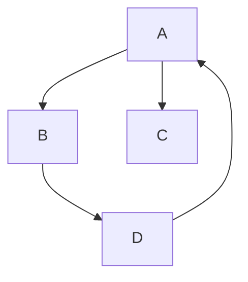
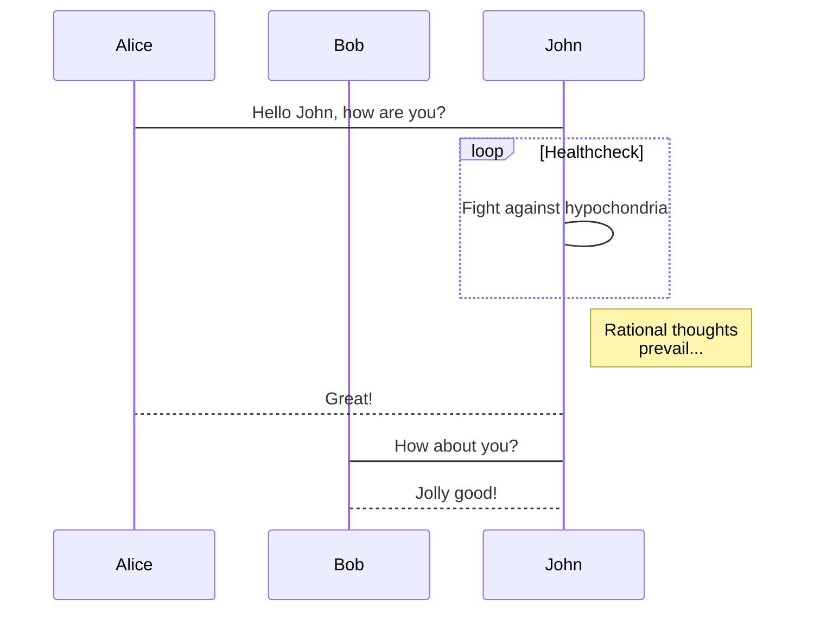
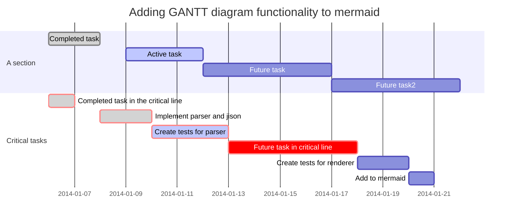
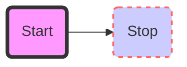

<!-- toc orderedList:0 -->

- [This is Markdown Preview with KaTeX Support](#this-is-markdown-preview-with-katex-support)
	- [Heading 2](#heading-2)
		- [Heading 3](#heading-3)
			- [Heading 4](#heading-4)
				- [Heading 5](#heading-5)
					- [Heading 6](#heading-6)

<!-- tocstop -->
# This is Markdown Preview with KaTeX Support
- write your math expression within $\$...\$$
    - $f(x) = sin(x) + y_a$
- write within $\$\$...\$\$$ to render in display mode
    - $$ \frac{1}{3} + 3x + 4y + \sum_{i=0}^{n}i$$
		- $sin(x) = 1$

## Heading 2   
### Heading 3
#### Heading 4  
##### Heading 5
###### Heading 6

```javascript
// this is comment
var add = function(x, y){
    return x + y
}
var x = 12
var y = 13
```
```clojure
(def x 12)
(def y 20)
(defn add [x y] (+ x y))
```

```java
// Java Comment
/**  This is Java Comment **/
public class Test {
  public static void main(String[] args) {
    System.out.println("Hello World");
  }
}
```

```c
/**
 * This is comment
 */
int main() {
    printf('Hello World\n');
    return 0;
}
```
---

> export your markdown to PDF or Haha


---
Test image paths   
  


---







```puml
A -> B
B -> C 
```

[Graphvizdot](http://www.graphviz.org/)
```puml
[*] --> State1
State1 --> [*]
State1 : this is a string
State1 : this is another string

State1 -> State2
State2 --> [*]
```

**Test opening files through links**
[markdown.png](1.pic.jpg)  
[markdown.png](/test/1.pic.jpg)  
[markdown-preview-enhanced.coffee](/lib/markdown-preview-enhanced.coffee)  
[markdown-preview-enhanced.coffee](../lib/markdown-preview-enhanced.coffee)

**Test Links**  
[baidu](https://www.baidu.com/)  
[this baidu should not work](www.baidu.com)


**Bugs Fix**  
- too many bugs
- [\$ bug](https://github.com/shd101wyy/markdown-preview-enhanced/issues/2)  
  \$ 12 + \$ 13 = 12
- the local font family for **styles/katex.min.less** should be eg: **atom://markdown-preview-enhanced/styles/fonts/KaTeX_AMS-Regular.eot** instead of **fonts/blabla.eot**   
see [this link](https://discuss.atom.io/t/how-do-i-load-google-fonts-into-my-editors-styles/8321/4)
- Now support **2-way scroll sync!**

[[wikilink]]
